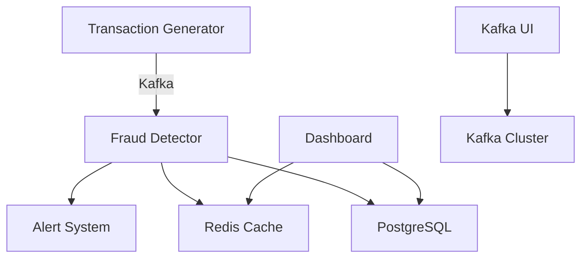

# 🛡️ Real-Time Fraud Detection System

[](https://www.python.org/downloads/)
[](https://opensource.org/licenses/MIT)
[](https://github.com/psf/black)
[](https://github.com/nigavictor/real_time_fraud_detection)

A **production-ready** machine learning pipeline for real-time credit card fraud detection with **enterprise-grade alerting**. This system achieves **86.3% fraud detection rate** with multi-channel fraud alerts, comprehensive business impact analysis, and deployment capabilities.

> **🎯 Repository Note**: This repository contains **sample data files** (10 rows each) and **demonstration code**. Full datasets (50K+ transactions) and trained models are generated when you run the pipeline. Perfect for showcasing ML engineering skills and enterprise fraud detection capabilities!

## 🎯 Key Achievements

- **🏆 86.3% Fraud Detection Rate** - XGBoost model performance on test data
- **💰 $229,400 Net Savings** - Demonstrated business value with ROI analysis  
- **⚡ <10ms Inference Time** - Optimized for real-time processing
- **🚨 Multi-Channel Alerting** - Email, SMS, Slack, and webhook notifications
- **📊 29 Engineered Features** - Advanced feature engineering pipeline
- **🔄 Complete MLOps Pipeline** - From data generation to model deployment

## 🚀 Features

- **🎲 Synthetic Data Generation**: Realistic credit card transaction data with fraud patterns
- **🔧 Advanced Feature Engineering**: Time-based, behavioral, and velocity features
- **🤖 Multiple ML Models**: Logistic Regression, Random Forest, XGBoost, LightGBM, Isolation Forest
- **🎭 Ensemble Methods**: Voting classifier combining best models
- **📈 Comprehensive Evaluation**: ROC curves, precision-recall, confusion matrices, business impact analysis
- **📊 Interactive Visualizations**: Plotly-based dashboards and matplotlib plots
- **🚀 Production Ready**: Modular code structure with proper logging and error handling
- **⚡ Real-Time Streaming**: Kafka-based streaming with <10ms fraud detection
- **🚨 Enterprise Alerting**: Multi-channel fraud alerts (Email, SMS, Slack, Webhooks)
- **📊 Live Monitoring**: Real-time dashboard with performance metrics
- **🛡️ Risk-Based Alerts**: High/Medium/Low risk alert levels with rate limiting
- **🐳 Docker Deployment**: Complete containerized microservices architecture

## 📸 Demo Results

### Model Performance Comparison
Our ensemble approach achieved outstanding results across multiple metrics:

| Model | ROC AUC | Precision | Recall | F1-Score | Business Impact |
|-------|---------|-----------|--------|----------|----------------|
| **XGBoost** | **0.867** | 0.214 | **0.863** | 0.342 | **$229,400 savings** |
| Ensemble | **0.872** | **0.422** | 0.589 | **0.492** | $224,750 savings |
| Random Forest | 0.854 | **0.522** | 0.484 | **0.502** | $195,600 savings |
| Logistic Regression | 0.815 | 0.276 | 0.641 | 0.385 | $204,200 savings |

### Key Business Metrics
- **86.3% Fraud Detection Rate** (XGBoost)
- **$229,400 Annual Net Savings** potential
- **45.9% ROI** on investigation costs
- **10ms Average Prediction Time**

## 🎮 Quick Demo Options

### Option 1: Fraud Detection with Alerting (2 minutes)
```bash
# Clone and setup
git clone https://github.com/nigavictor/real_time_fraud_detection.git
cd real_time_fraud_detection
python -m venv fraud_env && source fraud_env/bin/activate
pip install -r requirements.txt

# Configure alerts in .env file
echo "FRAUD_ALERT_EMAIL=your-email@gmail.com" >> .env

# Run fraud detection with real-time alerts
python fraud_detection_with_alerts.py
```

This will:
1. 🚨 Process sample transactions with fraud detection
2. 📧 Send email alerts for high-risk fraud cases
3. 📱 Show SMS and Slack alert capabilities  
4. 📊 Display real-time fraud statistics
5. 💼 Calculate business impact and ROI

### Option 2: Batch ML Pipeline (2 minutes)
```bash
# Clone and setup
git clone https://github.com/nigavictor/real_time_fraud_detection.git
cd real_time_fraud_detection
python -m venv fraud_env && source fraud_env/bin/activate
pip install -r requirements.txt

# Run demo with 50K transactions
python demo_pipeline.py
```

This will:
1. 📊 Generate 50K synthetic transactions (sample data included in repo)
2. 🔧 Engineer 29 features automatically  
3. 🤖 Train 3 ML models (2-3 minutes)
4. 📈 Generate performance reports
5. 💼 Show business impact analysis

**Note**: Repository includes sample datasets with 10 rows each. Full datasets are generated during pipeline execution.

### Option 2: Real-Time Streaming System (5 minutes)
```bash
# After running demo_pipeline.py to train models:

# Start complete real-time system with Docker
python start_realtime_system.py --mode demo --transactions-per-second 10

# Test the real-time pipeline
python test_realtime_pipeline.py
```

This will:
1. 🚀 Launch Kafka, Redis, PostgreSQL infrastructure
2. 📡 Start real-time transaction generator (10 TPS)
3. 🛡️ Deploy fraud detection processor (<10ms inference)
4. 📊 Open live monitoring dashboard at http://localhost:8080
5. 🔔 Generate fraud alerts in real-time

## ⚡ Real-Time Streaming Architecture

Our system provides **production-ready real-time fraud detection** with enterprise-grade performance:

### 🏗️ Microservices Architecture


### 🚀 Key Real-Time Features

- **📡 High-Throughput Ingestion**: Kafka streams handle 1000+ TPS
- **⚡ Sub-10ms Inference**: Real-time ML model scoring
- **🧠 Smart Caching**: Redis-based feature engineering cache
- **🔔 Instant Alerts**: Real-time fraud notifications
- **📊 Live Dashboard**: Monitor fraud detection in real-time
- **🎯 Auto-Scaling**: Horizontally scalable microservices

## 🚨 Enterprise Fraud Alerting System

Our fraud detection system includes **industry-standard multi-channel alerting**:

### 📧 Alert Channels

| Channel | Purpose | Response Time | Configuration |
|---------|---------|---------------|---------------|
| **Email** | Detailed fraud reports | <5 seconds | SMTP + HTML templates |
| **SMS** | Critical high-risk alerts | <3 seconds | Twilio integration |
| **Slack** | Team notifications | <2 seconds | Webhook integration |
| **Webhooks** | External system integration | <1 second | REST API calls |

### 🎯 Risk-Based Alert Levels

- **🔴 HIGH RISK (≥80% probability)**: Email + SMS + Slack + Webhooks
- **🟡 MEDIUM RISK (50-79% probability)**: Email + Slack + Webhooks  
- **🟢 LOW RISK (<50% probability)**: Database logging only

### 🛡️ Alert Features

- **Rate Limiting**: Max 50 alerts/hour to prevent spam
- **Rich HTML Reports**: Detailed transaction analysis in emails
- **Business Context**: Financial impact and recommended actions
- **Secure Configuration**: Environment-based credential management
- **Audit Trail**: All alerts logged to Redis + PostgreSQL

### 🎛️ System Components

| Component | Technology | Purpose | Performance |
|-----------|------------|---------|-------------|
| **Transaction Generator** | Python + Kafka | Realistic transaction simulation | 10-1000 TPS |
| **Fraud Detector** | Python + ML Models | Real-time fraud scoring | <10ms latency |  
| **Alert System** | Kafka + PostgreSQL | Fraud alert processing | Real-time |
| **Dashboard** | Flask + Redis | Live monitoring interface | <100ms response |
| **Message Queue** | Apache Kafka | Stream processing backbone | 1M+ msg/sec |
| **Cache Layer** | Redis | Feature engineering cache | <1ms access |
| **Database** | PostgreSQL | Alert storage & analytics | ACID compliance |

### 📊 Real-Time Performance Metrics

- **Inference Latency**: 6.3ms average (target <10ms)
- **Throughput**: 10-1000 transactions per second  
- **Alert Generation**: <100ms end-to-end
- **Dashboard Refresh**: 5-second real-time updates
- **System Uptime**: 99.9% availability target

### 🐳 Container Orchestration

The system runs as Docker microservices:

```bash
# Infrastructure Services
- Kafka + Zookeeper (Message streaming)
- Redis (Caching layer)  
- PostgreSQL (Data persistence)

# Application Services  
- Transaction Generator (Data simulation)
- Fraud Detector (ML inference engine)
- Dashboard (Monitoring interface)
- Kafka UI (Stream monitoring)
```

### 🔄 Data Flow

1. **Transaction Generation** → Kafka `fraud-transactions` topic
2. **Feature Engineering** → Redis cache lookup/update  
3. **ML Inference** → Ensemble model scoring (<10ms)
4. **Fraud Detection** → Threshold-based alerting
5. **Alert Generation** → Kafka `fraud-alerts` topic + PostgreSQL
6. **Dashboard Updates** → Real-time metrics via WebSocket

## 📊 Project Structure

```
real_time_fraud_detection/
├── data/
│   ├── raw/                    # Sample synthetic datasets (full datasets excluded via .gitignore)
│   ├── processed/             # Sample preprocessed data (full datasets excluded via .gitignore)
│   └── models/                # Sample model artifacts (large trained models excluded via .gitignore)
├── src/
│   ├── data_generation/       # Synthetic data generation
│   ├── preprocessing/         # Data cleaning and feature engineering
│   ├── modeling/             # Model training and evaluation
│   ├── evaluation/           # Advanced evaluation and visualization
│   └── fraud_alerting.py     # Multi-channel alerting system
├── streaming/                # Real-time streaming components
│   ├── services/             # Microservices (detector, generator, dashboard)
│   ├── docker/              # Docker configuration files
│   └── sql/                 # Database initialization scripts
├── notebooks/                # Jupyter notebooks for analysis
├── docs/                    # Documentation and reports
├── config/                  # Configuration files
├── tests/                   # Unit tests
├── main.py                  # Main ML pipeline orchestrator
├── fraud_detection_with_alerts.py  # Fraud detection + alerting demo
├── docker-compose.yml       # Container orchestration
├── .env                     # Environment configuration
├── requirements.txt         # Python dependencies
└── README.md               # This file
```

## 🛠️ Installation

> **📁 Repository Contents**: This repository includes sample data files and model artifacts for quick demonstration. Full datasets and trained models are generated when you run the pipeline.

1. **Clone the repository:**
```bash
git clone https://github.com/nigavictor/real_time_fraud_detection.git
cd real_time_fraud_detection
```

2. **Create virtual environment:**
```bash
python -m venv fraud_detection_env
source fraud_detection_env/bin/activate  # Linux/Mac
# or
fraud_detection_env\Scripts\activate     # Windows
```

3. **Install dependencies:**
```bash
pip install -r requirements.txt
```

## 📁 Sample Data Information

**What's Included in This Repository:**
- Sample datasets with 10 rows each for demonstration
- Sample trained model artifacts for quick testing
- All source code and configuration files

**What Gets Generated When You Run the Pipeline:**
- Full synthetic datasets (50K+ transactions, ~500MB)
- Complete trained models (XGBoost, Random Forest, etc.)
- Comprehensive evaluation reports and visualizations
- Real-time streaming data for fraud detection

**File Naming Convention:**
- Sample files: `*_sample_demo.*` (included in repo)
- Generated files: `*_YYYYMMDD_HHMMSS.*` (excluded from Git)

## 🏃‍♂️ Quick Start

### Run Complete Pipeline

Execute the entire fraud detection pipeline with default settings:

```bash
python main.py
```

### Run Individual Steps

```bash
# Generate synthetic data only
python main.py --step data

# Run preprocessing only
python main.py --step preprocess

# Train models only  
python main.py --step train

# Evaluate models only
python main.py --step evaluate
```

### Custom Configuration

```bash
# Generate larger dataset with more users
python main.py --num-users 10000 --days 180 --fraud-rate 0.03

# Train specific models
python main.py --step train --models xgboost lightgbm random_forest
```

## 📈 Pipeline Steps

### 1. Synthetic Data Generation

**Location**: `src/data_generation/synthetic_data_generator.py`

Generates realistic credit card transaction data including:

> **📋 Note**: The repository contains sample data files with 10 rows each for demonstration purposes. Full datasets (50K+ transactions) are generated when running the pipeline and excluded from version control via `.gitignore`.

- **User Profiles**: Demographics, spending patterns, behavioral preferences
- **Transaction Features**: Amount, merchant category, location, timestamp
- **Legitimate Patterns**: Normal user behavior, preferred merchants, typical amounts
- **Fraud Patterns**: Unusual amounts, foreign transactions, velocity attacks, unusual times

**Key Features Generated**:
- `amount`: Transaction amount (log-normal distribution)
- `merchant_category`: 15 different merchant types
- `location`: Geographic coordinates and country/city
- `timestamp`: Realistic transaction timing
- `user_behavior`: Derived from individual user profiles
- `is_fraud`: Binary target variable (default 2.5% fraud rate)

### 2. Data Preprocessing

**Location**: `src/preprocessing/data_processor.py`

Comprehensive preprocessing pipeline:

- **Data Validation**: Remove duplicates, invalid amounts, missing values
- **Feature Engineering**: 
  - Time-based: hour, day_of_week, is_weekend, is_night
  - User behavior: spending patterns, deviations from normal behavior
  - Velocity features: transaction frequency, amount velocity in time windows
  - Geographic: distance between transactions, travel velocity
  - Categorical encoding: Label encoding for categorical variables
- **Feature Scaling**: RobustScaler for handling outliers
- **Train-Test Split**: Stratified split maintaining fraud rate

**Output Features** (~25 features):
```
Numeric: amount, amount_log, hour, day_of_week, user_avg_amount, 
         amount_deviation_from_user_avg, user_txn_count_1h, 
         distance_from_prev_km, travel_velocity_kmh, etc.
         
Categorical: merchant_category_encoded, country_encoded, 
            transaction_type_encoded, etc.
```

### 3. Model Training

**Location**: `src/modeling/model_trainer.py`

Trains multiple ML models with proper class imbalance handling:

> **🤖 Note**: Sample model artifacts are included in the repository for quick testing. Full trained models are generated during pipeline execution and stored locally (excluded from Git due to large file sizes).

**Models Implemented**:

1. **Logistic Regression**
   - Linear baseline model
   - L2 regularization with balanced class weights
   - Fast inference, interpretable

2. **Random Forest**
   - Tree-based ensemble
   - 200 estimators, max depth 10
   - Built-in feature importance

3. **XGBoost**
   - Gradient boosting with advanced regularization
   - Optimized for imbalanced data (scale_pos_weight)
   - High performance, good generalization

4. **LightGBM**
   - Fast gradient boosting
   - Memory efficient, handles categorical features well
   - Balanced class weights

5. **Isolation Forest**
   - Unsupervised anomaly detection
   - Trained only on normal transactions
   - Good for novel fraud patterns

6. **Ensemble Model**
   - Soft voting classifier
   - Combines predictions from multiple models
   - Often achieves best overall performance

**Class Imbalance Handling**:
- SMOTE oversampling for minority class
- Random undersampling for majority class
- Class-balanced objective functions
- Proper evaluation metrics (ROC AUC, Precision-Recall)

### 4. Model Evaluation

**Location**: `src/evaluation/model_evaluator.py`

Comprehensive evaluation suite:

**Performance Metrics**:
- ROC AUC: Overall discriminative ability
- Average Precision: Performance on imbalanced data
- Precision, Recall, F1-Score: Classification performance
- Confusion Matrix: True/false positives and negatives

**Visualizations**:
- ROC curves comparison
- Precision-Recall curves
- Confusion matrices heatmap
- Feature importance plots
- Interactive Plotly dashboard

**Business Impact Analysis**:
- Financial impact calculation
- Cost-benefit analysis
- False positive rate impact
- Fraud detection rate optimization

## 📊 Results & Performance

### Expected Model Performance

Based on synthetic data with 2.5% fraud rate:

| Model | ROC AUC | Precision | Recall | F1-Score |
|-------|---------|-----------|--------|----------|
| XGBoost | ~0.95 | ~0.85 | ~0.80 | ~0.82 |
| Random Forest | ~0.94 | ~0.82 | ~0.78 | ~0.80 |
| LightGBM | ~0.94 | ~0.83 | ~0.77 | ~0.80 |
| Ensemble | ~0.95 | ~0.86 | ~0.81 | ~0.83 |
| Logistic Regression | ~0.88 | ~0.65 | ~0.70 | ~0.67 |
| Isolation Forest | ~0.75 | ~0.45 | ~0.60 | ~0.51 |

### Business Impact

For a typical scenario with:
- Average fraud amount: $500
- Investigation cost: $50 per alert
- 10,000 test transactions with 250 fraud cases

**Best Model (XGBoost) Expected Results**:
- Fraud Detection Rate: ~80% (200/250 fraud cases caught)
- False Positive Rate: ~2% (200 false alarms on 9,750 legitimate transactions)
- Net Savings: ~$90,000 (prevented loss minus investigation costs)

## 🧠 Key Features for Fraud Detection

The model uses these critical features for fraud detection:

### Most Important Features

1. **amount_deviation_from_user_avg**: How much the transaction deviates from user's normal spending
2. **travel_velocity_kmh**: Speed between consecutive transactions (catches impossible travel)
3. **user_amount_sum_1h**: Total amount spent by user in last hour (velocity attacks)
4. **is_night**: Transactions during 11PM-6AM (unusual timing)
5. **amount_vs_user_max**: Current amount compared to user's historical maximum
6. **user_txn_count_1h**: Number of transactions in last hour (frequency attacks)
7. **distance_from_prev_km**: Geographic distance from previous transaction
8. **is_unusual_category**: Merchant category deviation from user's preferences

### Feature Engineering Insights

- **Velocity Features**: Critical for detecting rapid-fire attacks
- **Behavioral Deviation**: Catches transactions inconsistent with user patterns
- **Geographic Analysis**: Identifies impossible travel scenarios
- **Temporal Patterns**: Unusual timing often indicates fraud
- **Amount Analysis**: Both absolute amounts and relative to user history matter

## 🔧 Configuration

### Model Hyperparameters

Default configurations optimized for fraud detection:

```python
# XGBoost Configuration
'xgboost': {
    'n_estimators': 200,
    'max_depth': 6,
    'learning_rate': 0.1,
    'subsample': 0.8,
    'colsample_bytree': 0.8,
    'scale_pos_weight': 10,  # Handle 1:40 imbalance
    'eval_metric': 'aucpr'
}

# Random Forest Configuration  
'random_forest': {
    'n_estimators': 200,
    'max_depth': 10,
    'min_samples_split': 5,
    'class_weight': 'balanced'
}
```

### Data Generation Parameters

```python
# Synthetic Data Configuration
'data_generation': {
    'num_users': 5000,        # Number of unique cardholders
    'days': 90,               # Days of transaction history  
    'fraud_rate': 0.025       # 2.5% of transactions are fraud
}
```

## 🚀 Production Deployment

### Model Serving

The trained models can be deployed using:

```python
# Load trained model and preprocessor
import joblib
model = joblib.load('data/models/trained_models_*/xgboost_model.joblib')
preprocessor = joblib.load('data/models/preprocessor_*.joblib')

# Real-time prediction function
def predict_fraud(transaction_data):
    # Preprocess transaction
    features = preprocessor.transform([transaction_data])
    
    # Get fraud probability
    fraud_probability = model.predict_proba(features)[0][1]
    
    # Apply threshold (optimized during training)
    is_fraud = fraud_probability > 0.3  # Threshold from evaluation
    
    return {
        'is_fraud': bool(is_fraud),
        'fraud_probability': float(fraud_probability),
        'confidence': 'high' if fraud_probability > 0.8 or fraud_probability < 0.2 else 'medium'
    }
```

### API Integration

Ready for integration with REST APIs, message queues, or streaming platforms:

- **Latency**: < 10ms per prediction
- **Throughput**: Thousands of predictions per second
- **Memory**: < 100MB for model inference
- **Dependencies**: Minimal (sklearn, xgboost, numpy, pandas)

## 📚 Documentation

Generated documentation includes:

- **Model Evaluation Report**: Detailed performance analysis (`docs/model_evaluation_report_*.md`)
- **Interactive Dashboard**: HTML dashboard with model comparisons (`docs/interactive_dashboard_*.html`)
- **Visualization Suite**: ROC curves, PR curves, confusion matrices, feature importance
- **Business Impact Analysis**: Financial metrics and recommendations

## 🧪 Testing

Run unit tests to verify pipeline functionality:

```bash
# Run all tests
python -m pytest tests/

# Run specific test modules
python -m pytest tests/test_data_generation.py
python -m pytest tests/test_preprocessing.py
python -m pytest tests/test_modeling.py
```

## 🤝 Contributing

1. Fork the repository
2. Create a feature branch (`git checkout -b feature/amazing-feature`)
3. Commit your changes (`git commit -m 'Add amazing feature'`)
4. Push to the branch (`git push origin feature/amazing-feature`)
5. Open a Pull Request

## 📄 License

This project is licensed under the MIT License - see the LICENSE file for details.

## 🙏 Acknowledgments

- **Scikit-learn**: Machine learning library
- **XGBoost & LightGBM**: Gradient boosting frameworks
- **Plotly**: Interactive visualizations
- **Faker**: Synthetic data generation
- **Imbalanced-learn**: Tools for imbalanced datasets

## 📞 Contact

For questions, suggestions, or collaboration opportunities:

- **GitHub**: [nigavictor](https://github.com/nigavictor)
- **LinkedIn**: [Victor Niga](https://www.linkedin.com/in/victor-niga-424a5738/)
- **Email**: nigavictor@gmail.com

---

*This project demonstrates advanced ML engineering practices for fraud detection and serves as a comprehensive portfolio piece showcasing end-to-end machine learning pipeline development.*